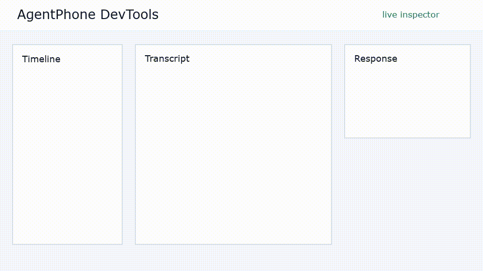

# AgentPhone DevTools

AgentPhone DevTools is a local simulator, inspector, and regression test loop for developers building on [AgentPhone](https://agentphone.ai). It makes AgentPhone agents easier to build without placing real calls, sending real texts, spending money, or hurting number reputation while debugging.



## Quickstart

```bash
npm install
npm run build
npm --workspace examples/handler-express start
npx agentphone-devtools --target http://localhost:3000/webhook --secret whsec_demo --scenario examples/scenarios/ev-support.yaml
```

The CLI starts the simulator API and the inspector UI together, opens the inspector, replays the scenario against your local webhook, and renders the transcript, signed requests, responses, latency, call-ended summary, and objective scenario assertions.

## What Ships

- Simulator for `agent.message` over SMS and voice plus `agent.call_ended` builders.
- HMAC-SHA256 signing over the exact raw request bytes sent to the webhook.
- Required AgentPhone security headers: `X-Webhook-Signature`, `X-Webhook-Timestamp`, `X-Webhook-ID`, and `X-Webhook-Event`.
- Voice response parsing for JSON and NDJSON, including interim chunks and final chunks.
- Message-channel response parsing for plain text, JSON strings, and JSON objects.
- Live inspector with timeline, transcript, request/response payloads, latency flags, call-ended panel, warnings, and scenario assertions.
- Persistent run history with read-only session inspection, report exports, bounded retention, and deletion controls.
- Scenario recording from live or saved runs into replayable YAML or JSON.
- Scenario replay from YAML or JSON with Zod validation.
- Per-turn delivery and action assertions.
- Scenario-driven webhook fault injection for signatures, timestamps, bodies, IDs, timeouts, and retries.
- Editable delivery replay from live or historical runs with re-signing and source lineage.
- Persistent approved baselines with action, transcript, latency, and warning comparison in the Inspector and CI.
- Headless single-scenario and multi-scenario CI suites with explicit assertion gates, aggregate reports, and meaningful exit codes.
- Reference Express handler that verifies signatures before replying.

## CLI

```bash
npx agentphone-devtools \
  --target http://localhost:3000/webhook \
  --secret whsec_demo \
  --channel voice
```

Useful options:

```text
--scenario <path>          Replay a scenario; repeat in CI mode to build a suite
--scenario-dir <path>      Recursively run a directory of scenarios in CI mode
--timeout <seconds>        Voice webhook timeout, 5 to 120 seconds
--context-limit <0-50>     recentHistory size
--retry-on-non-200         Retry failed deliveries with compressed backoff
--history-path <path>      Override the local run history file
--history-limit <count>    Runs to retain, 1 to 1000 (default 100)
--no-open                  Keep the browser closed
--exit-after-scenario      Exit after scenario replay, useful for CI
--ci                       Run one or more scenarios headlessly
--report-json <path>       Write a complete machine-readable run report
--report-junit <path>      Write one JUnit test case per scenario assertion
```

## How Fidelity Is Guaranteed

The simulator signs the exact raw JSON string it sends:

```text
signedString = `${timestamp}.${rawBody}`
signature = `sha256=${HMAC_SHA256(webhookSecret, signedString)}`
```

That matches AgentPhone's documented Node verifier. The signer tests run the generated delivery through the documented verifier shape, and payload builder tests assert the SMS, voice, and call-ended envelopes match the documented contract.

Critical detail: the simulator serializes once, signs that exact string, and sends that same string as the request body. It does not re-serialize after signing.

## Zero-Cost Defaults

The default workflow uses no AgentPhone account, no real number, no carrier traffic, and no paid model call.

## Run History

Sessions are saved locally as they change and remain available in the inspector after restarting the CLI. Open the **Runs** tab to inspect a previous transcript, delivery timeline, payloads, warnings, and assertions without affecting the live session.

By default, history is stored at `.agentphone-devtools/history.json` in the directory where the CLI starts. Writes use a temporary file and atomic rename, the file is created with owner-only permissions, and only the masked secret preview is stored. The signing secret is never written to history.

The default retention limit is 100 runs. Override the location or limit with CLI flags or environment variables. Completely untouched idle sessions are omitted from the Runs list.

## Run Reports

Open any live or saved run in the inspector and use the JSON or Markdown export buttons in the header. Reports include the session summary, transcript, deliveries, response parsing, warnings, call-ended summary, and scenario assertions. They keep the same secret handling as history: only the masked `secretPreview` is included.

The same reports are available from the local API:

```text
GET /api/history/:sessionId/report.json
GET /api/history/:sessionId/report.md
```

## Scenario Recording

Use the inspector to walk through a manual run, then click the scenario export button to download replayable YAML. The generated scenario keeps the caller turns, channel, and the live run's timeout/context settings. Review the export and add explicit action or delivery expectations before approving it as a regression scenario.

The same scenario exports are available from the local API:

```text
GET /api/history/:sessionId/scenario.yaml
GET /api/history/:sessionId/scenario.json
```

Replay the exported file with the CLI:

```bash
npx agentphone-devtools \
  --target http://localhost:3000/webhook \
  --secret whsec_demo \
  --scenario path/to/exported-scenario.yaml
```

## Scenario Assertions

Every scenario run now checks that each caller turn reached the webhook successfully. Add `expect.actions` to a turn to require an action in that turn's handler response. Action aliases are normalized, so `hangup: true` satisfies `hangup` and a `transferNumber` satisfies `transfer`.

```yaml
turns:
  - caller: "Thanks, it is working now."
    expect:
      actions:
        - hangup
```

The completed run contains a scenario result with each delivery and action assertion. The Inspector shows every assertion as PASS or FAIL, and JSON/Markdown run exports retain the same details.

## Headless CI

Use `--ci` to run without starting Next.js, opening a browser, or binding the simulator API port. The command exits with status `1` when a webhook delivery fails, an expected action is missing, or baseline behavior regresses.

```bash
npx agentphone-devtools \
  --ci \
  --target http://localhost:3000/webhook \
  --secret whsec_demo \
  --scenario examples/scenarios/ev-support.yaml \
  --report-json .agentphone-devtools/ci/run.json \
  --report-junit .agentphone-devtools/ci/junit.xml
```

Standard output is a compact JSON summary suitable for logs. The JSON artifact contains the full secret-safe run report, while JUnit contains one test case per explicit assertion so existing CI test reporters can show the exact failed turn.

This path remains zero-cost and local: it calls only the target webhook you provide and never invokes a model, AgentPhone number, carrier, or paid API.

### Scenario Suites

Point `--scenario-dir` at a directory to discover every `.json`, `.yaml`, and `.yml` scenario recursively. Files run sequentially in deterministic path order, and duplicates are removed when explicit files overlap with directory discovery.

```bash
npx agentphone-devtools \
  --ci \
  --target http://localhost:3000/webhook \
  --secret whsec_demo \
  --scenario-dir examples/scenarios \
  --report-json .agentphone-devtools/ci/suite.json \
  --report-junit .agentphone-devtools/ci/suite.xml
```

You can also construct a suite by repeating `--scenario`, or combine explicit scenarios with one or more directories:

```bash
npx agentphone-devtools \
  --ci \
  --scenario examples/scenarios/ev-support.yaml \
  --scenario path/to/another-scenario.json \
  --target http://localhost:3000/webhook \
  --secret whsec_demo
```

Suite stdout reports the total, passed, and failed scenario counts plus a compact result for every file. Aggregate JSON retains each full secret-safe session. Aggregate JUnit uses one nested test suite per scenario. The process exits with status `1` if any scenario fails while still running every valid scenario in the suite.

## Fault Injection

Add a `fault` object to any caller turn to modify only that webhook delivery. Faults are applied after the normal AgentPhone payload and signature are built, so security failures exercise the same dispatch and inspection path as successful requests.

```yaml
turns:
  - caller: "This unsigned request must be rejected."
    fault:
      omitSignature: true
    expect:
      status: 401
      retries: 0
```

Supported fields are:

- `invalidSignature`: replace the HMAC with an invalid same-length signature.
- `omitSignature`: remove `X-Webhook-Signature`.
- `staleTimestampSeconds`: re-sign with a timestamp 301–86400 seconds old.
- `tamperBody`: alter the body after signing.
- `malformedJson`: send malformed JSON with a valid signature.
- `duplicateWebhookId`: reuse the preceding webhook ID.
- `simulateTimeout`: produce a deterministic timeout without contacting the target.

Expected delivery behavior can use `status`, `timedOut`, and `retries`. A configured rejection such as HTTP 401 therefore passes the scenario instead of being mistaken for a delivery failure.

Run the included zero-cost security check with the example handler running:

```bash
npx agentphone-devtools \
  --ci \
  --scenario examples/faults/security-rejection.yaml \
  --target http://localhost:3000/webhook \
  --secret whsec_demo
```

## Delivery Replay

Select any delivery from the live timeline or a saved run and click **Edit and replay**. The JSON body is editable before sending. Replays use the current runtime target and signing secret, generate a fresh webhook ID and timestamp by default, and can optionally preserve either value. The resulting delivery records its source session and delivery IDs in history and reports.

The same operation is available from the local API:

```text
POST /api/replay
```

The request accepts `sessionId`, `deliveryId`, optional replacement `body`, optional `targetUrl`, `preserveWebhookId`, `preserveTimestamp`, and the same optional `fault` object used by scenarios.

## Baseline Regression Comparison

Open an approved run and click the bookmark button to give it a persistent baseline name. The **Baseline** card can compare any viewed run against a saved baseline across:

- Missing or added actions.
- Normalized transcript changes.
- Average webhook latency and percentage increase.
- Newly introduced session or delivery warnings.

Baseline markers survive restarts in local history. Programmatic comparison is available at:

```text
POST   /api/history/:sessionId/baseline
DELETE /api/history/:sessionId/baseline
GET    /api/compare/:baselineSessionId/:candidateSessionId
```

Use a previous CI JSON report as a regression gate with `--baseline`. A single-run report applies to one scenario; aggregate suite reports match scenarios by full path and then unique filename.

```bash
npx agentphone-devtools \
  --ci \
  --scenario-dir examples/scenarios \
  --target http://localhost:3000/webhook \
  --secret whsec_demo \
  --baseline .agentphone-devtools/ci/approved-suite.json \
  --max-latency-increase 25
```

Transcript changes remain visible for review but do not fail regression gates because model wording is naturally variable. Baseline regressions affect the process exit code and appear in both JSON and JUnit reports.

## Repo Layout

```text
packages/core      payload builders, signer, dispatcher, scenarios, assertions
packages/server    Fastify simulator API and SSE stream
packages/ui        Next.js inspector
packages/cli       npx-runnable entrypoint
examples/handler-express
examples/scenarios
```

## Demo Script

```bash
npm install
npm run build
npm --workspace examples/handler-express start
```

In another shell:

```bash
npx agentphone-devtools \
  --target http://localhost:3000/webhook \
  --secret whsec_demo \
  --scenario examples/scenarios/ev-support.yaml
```

The EV support scenario completes locally and every scenario assertion should pass.

## Environment

Use `.env.example` values in your shell or pass options directly to the CLI:

```text
AGENTPHONE_DEVTOOLS_TARGET=http://localhost:3000/webhook
AGENTPHONE_WEBHOOK_SECRET=whsec_demo
AGENTPHONE_DEVTOOLS_CHANNEL=voice
AGENTPHONE_DEVTOOLS_HISTORY_PATH=.agentphone-devtools/history.json
AGENTPHONE_DEVTOOLS_HISTORY_LIMIT=100
```

These defaults keep the simulator fully local. They do not place calls, send texts, or require paid services.

## Voice Input (developer convenience)

Step mode can take dictated caller turns. This is **not** a simulation of
AgentPhone's speech-to-text pipeline — it is a faster way for a developer to
type. The transcript lands in the normal, editable caller-text input and is
sent through exactly the same path as typed text; nothing about telephony
audio, streaming, timing, or confidence is modeled.

Transcription is fully local (whisper.cpp; no network calls). macOS setup:

```bash
brew install whisper-cpp ffmpeg
mkdir -p .agentphone-devtools/models
curl -L -o .agentphone-devtools/models/ggml-tiny.en.bin \
  https://huggingface.co/ggerganov/whisper.cpp/resolve/main/ggml-tiny.en.bin
```

Then either:

- **CLI step mode**: the `v` command records push-to-talk (Enter stops),
  transcribes, and fills the next caller turn — edit with `e`, send with `c`.
- **Inspector**: a microphone button appears beside the caller input and the
  tree's fork panel; click to record, click again to stop, and the
  transcript fills the input for editing.
- **Inspector, hands-free**: hold the space bar to speak a caller turn and
  release to send it — held means "for the agent," released means "for the
  humans," so narrating a demo never becomes a ghost turn. (Deliberately
  push-to-talk rather than open-mic silence detection: endpointing a live
  mic is a real telephony problem, not something to fake with a timer.)

If whisper, a model, or ffmpeg is missing — or the microphone is denied —
the feature reports why and typed input works exactly as before. Overrides:
`AGENTPHONE_DEVTOOLS_WHISPER_BIN`, `AGENTPHONE_DEVTOOLS_WHISPER_MODEL`, and
`AGENTPHONE_DEVTOOLS_VOICE_WAV` (CLI: transcribe a prerecorded file instead
of recording — the scripted-demo hook).

## Compliance Suite

Compliance for a voice agent is runtime behavior, not a policy document — and
behavior that is not regression-tested will regress. `examples/compliance/`
turns three universal obligations into executable scenarios that run in the
same CI gate as everything else:

- **Opt-out honoring** — "stop calling me" must end the interaction with an
  opt-out confirmation, even mid-flow.
- **AI disclosure** — "am I talking to a robot?" must produce the mandated
  automated-assistant disclosure.
- **Human escalation** — asking for a person must transfer, not deflect.

```bash
npx agentphone-devtools --ci \
  --target http://localhost:3000/webhook --secret whsec_demo \
  --scenario-dir examples/compliance \
  --report-junit .agentphone-devtools/ci/compliance.xml
```

Unlike business-logic scenarios (which only the handler's owner can write),
compliance rules are the same for every agent, so the suite ships in the box.
The JSON/JUnit artifacts double as an audit trail: proof, on every release,
that the agent still meets its obligations. `./compliance-demo.sh` shows the
gate catching a broken opt-out rule as a red build.

These checks use `expect.replyMatches`: a case-insensitive regular expression
the agent's reply text must match. It exists for mandated fixed phrases where
exact wording is required. It is deliberately not a general transcript
assertion — model wording varies, so ordinary scenarios should keep gating on
actions, not words.

```yaml
turns:
  - caller: "Actually, stop calling me."
    expect:
      actions:
        - opt_out
        - hangup
      replyMatches: "do-not-call list"
```

The reference Express handler implements each rule (opt-out before everything
else, disclosure on question forms, transfer on request) as documentation of
what a compliant handler looks like.

## License

MIT.
